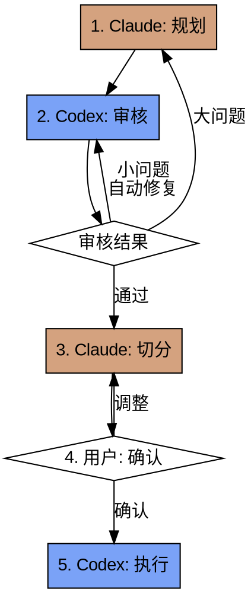

<p align="center">
  
</p>

<h1 align="center">Duet</h1>

<p align="center">
  <strong>Claude + Codex 协作工作流</strong>
</p>

<p align="center">
  质量优先，兼顾效率的双 Agent 开发模式
</p>

<p align="center">
  <a href="#-是什么">是什么</a> •
  <a href="#-安装">安装</a> •
  <a href="#-使用">使用</a> •
  <a href="#-工作流程">工作流程</a> •
  <a href="#-目录结构">目录结构</a>
</p>

<p align="center">
  
  
  
</p>

---

## 🎯 是什么

**Duet** 是一个 [Claude Code](https://github.com/anthropics/claude-code) skill，通过协调两个 AI Agent 的协作，实现更高质量、更高效率的软件开发：

| Agent | 角色定位 | 擅长领域 |
|-------|----------|----------|
| **Claude Code** 🎨 | 规划者 & 协调者 | 架构设计、复杂推理、任务分解 |
| **Codex** ⚡ | 审核者 & 执行者 | 代码审查、高效执行、终端任务 |

### 为什么需要 Duet？

```
传统模式：Claude 单独完成所有工作
    ↓
问题：复杂任务容易遗漏细节，执行效率不高

Duet 模式：Claude 规划 → Codex 审核 → Claude 切分 → Codex 执行
    ↓
优势：双重检查确保质量，各司其职提升效率
```

### 核心特点

- ✅ **质量优先** - Codex 审核确保规划合理，减少返工
- ⚡ **效率提升** - Codex 高效执行，比 Claude 单独执行更快
- 📝 **可追溯** - 所有规划、任务、执行记录均有文档
- 🔧 **灵活介入** - 支持人工处理复杂情况

---

## 📦 安装

### 前置条件

- [Claude Code](https://github.com/anthropics/claude-code) 已安装
- [Codex CLI](https://github.com/openai/codex) 已安装：`npm install -g @openai/codex`
- Codex 已完成认证配置
- 项目已初始化 git

### 方式 1：一键安装（推荐）

```bash
git clone https://github.com/potatokillar/duet.git
cd duet
./skills/duet/install.sh
```

### 方式 2：手动安装

```bash
mkdir -p ~/.claude/skills/duet
curl -o ~/.claude/skills/duet/SKILL.md \
  https://raw.githubusercontent.com/potatokillar/duet/main/skills/duet/SKILL.md
```

### 方式 3：作为 Git 子模块

```bash
git submodule add https://github.com/potatokillar/duet.git .claude/skills/duet
```

### 验证安装

```bash
ls ~/.claude/skills/duet/SKILL.md
# 应输出: /home/xxx/.claude/skills/duet/SKILL.md
```

---

## 🚀 使用

### 快速开始

在 Claude Code 中，开始复杂开发任务时：

```
使用 duet 工作流来开发用户认证功能
```

Claude Code 会自动加载 skill 并引导你完成整个流程。

### 适用场景

| 场景 | 推荐使用 |
|------|----------|
| 🟢 复杂功能开发 | ✅ 是 |
| 🟢 多文件协调修改 | ✅ 是 |
| 🟢 质量要求高的关键代码 | ✅ 是 |
| 🟡 简单单文件修改 | ❌ 直接用 Codex |
| 🟡 紧急修复 | ❌ 跳过审核 |
| 🟡 探索性任务 | ❌ 无需正式规划 |

### 示例对话

```
用户: 使用 duet 工作流来开发一个用户登录功能

Claude: 我正在使用 duet 工作流。

[阶段 1: 规划]
正在创建设计文档 docs/superpowers/specs/2026-03-21-user-login-design.md...
已完成规划，包含以下参考文件：
- src/types/user.ts
- src/utils/validation.ts

[阶段 2: 审核]
正在调用 Codex 进行审核...

Codex 审核结果:
REVIEW_RESULT: NEEDS_FIX
ISSUES:
- 缺少密码强度验证 - SEVERITY: MEDIUM
- 建议添加登录失败次数限制 - SEVERITY: LOW
SPLIT_SUGGESTION:
- Task 1: 密码验证逻辑
- Task 2: 登录 API 端点
- Task 3: 前端表单组件

[阶段 3: 修复 + 切分]
正在自动修复 MEDIUM 级别问题...
正在切分任务...

[阶段 4: 确认]
任务列表已生成，共 3 个任务：
- Task 01: 密码验证逻辑（无依赖）
- Task 02: 登录 API 端点（依赖 Task 01）
- Task 03: 前端表单组件（依赖 Task 02）

是否确认开始执行？
```

---

## 🔄 工作流程



### 流程阶段

| 阶段 | 执行者 | 输入 | 输出 |
|------|--------|------|------|
| 1. 规划 | Claude | 用户需求 | 设计文档（含参考文件列表） |
| 2. 审核 | Codex | 设计文档 | 审核结果 + 切分建议 |
| 3. 切分 | Claude | 审核建议 | 任务设计文档 |
| 4. 确认 | 用户 | 任务列表 | 确认/调整 |
| 5. 执行 | Codex | 任务文档 | 实现代码 |

### 问题分级

| 级别 | 定义 | 处理方式 |
|------|------|----------|
| 🟢 **LOW** | 格式/命名/文档问题 | Claude 自动修复 |
| 🟡 **MEDIUM** | 澄清性问题 | Claude 自动补充 |
| 🔴 **HIGH** | 架构/逻辑问题 | 人工介入 |

---

## 📁 目录结构

### 项目结构

```
duet/
├── README.md                   # 项目说明
├── LICENSE                     # MIT License
├── docs/
│   ├── assets/
│   │   └── logo.svg           # 项目 Logo
│   ├── superpowers/
│   │   ├── specs/             # 设计文档（本项目的 specs）
│   │   │   └── 2026-03-21-duet-skill-design.md
│   │   └── plans/             # 实施计划
│   │       └── 2026-03-21-duet-skill.md
│   └── ...
└── skills/
    └── duet/
        ├── SKILL.md           # Skill 主文件
        └── install.sh         # 安装脚本
```

### 使用时生成的目录结构

在你的项目中使用 duet 时，会生成以下结构：

```
your-project/
└── docs/
    └── superpowers/
        ├── specs/
        │   └── 2026-03-21-feature-design.md    # 总体规划
        └── tasks/
            └── 2026-03-21-feature/
                ├── 01-task-name.md              # 任务设计
                ├── 02-task-name.md
                └── ...
```

---

## 📋 快速参考

| 阶段 | 命令/动作 |
|------|----------|
| 规划 | 创建 `docs/superpowers/specs/xxx-design.md` |
| 审核 | `codex exec "Review..."` |
| 切分 | 创建 `docs/superpowers/tasks/xxx/` 目录 |
| 确认 | 向用户展示任务列表 |
| 执行 | `codex exec "Execute task..."` |

---

## 🤝 贡献

欢迎贡献！请查看 [贡献指南](CONTRIBUTING.md)。

### 开发

```bash
git clone https://github.com/potatokillar/duet.git
cd duet
```

---

## 📄 License

[MIT License](LICENSE)

---

## 🙏 致谢

- [Claude Code](https://github.com/anthropics/claude-code) - Anthropic 的终端 AI 编程助手
- [Codex CLI](https://github.com/openai/codex) - OpenAI 的轻量级编码代理

---

<p align="center">
  Made with ❤️ by <a href="https://github.com/potatokillar">potatokillar</a>
</p>
