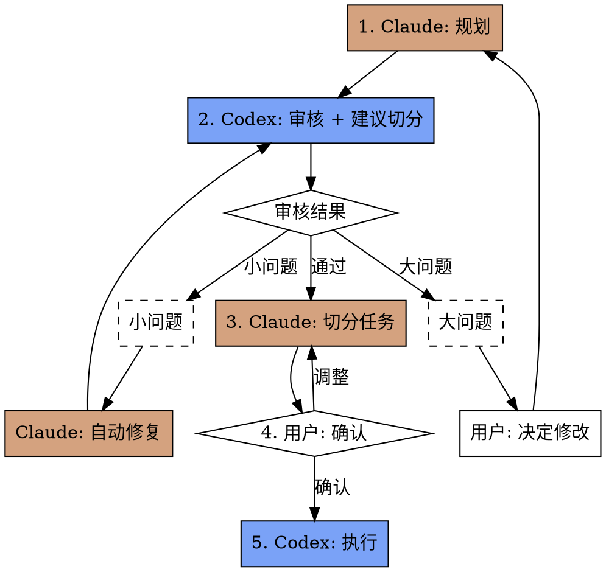
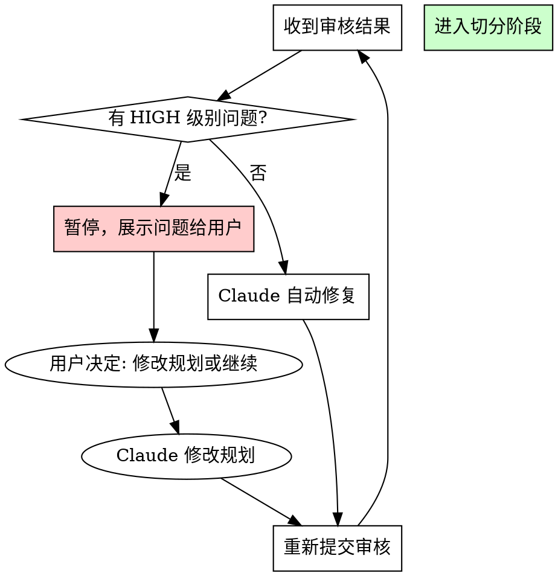

# Duet Skill 设计文档

> **目标**：设计一个 Claude Code skill，协调 Claude（规划/切分）与 Codex（审核/执行）协同工作，实现质量优先、兼顾效率的开发工作流。

## 概述

**Duet** 是一个双 Agent 协作工作流 skill，运行于 Claude Code 中。它利用两个 Agent 的各自优势：

- **Claude Code**：擅长规划、架构设计、复杂推理、任务切分
- **Codex**：擅长高效执行、代码审查、终端任务

**核心原则**：质量优先，兼顾效率

## 工作流程



### 流程说明

| 阶段 | 执行者 | 输入 | 输出 |
|------|--------|------|------|
| 1. 规划 | Claude | 用户需求 | 规划文档（含参考文件） |
| 2. 审核 | Codex | 规划文档 | 审核结果 + 切分建议 |
| 3. 切分 | Claude | 审核建议 + 规划 | 任务设计文档 |
| 4. 确认 | 用户 | 任务列表 | 确认/调整 |
| 5. 执行 | Codex | 任务设计文档 | 实现代码 |

---

## 阶段 1：Claude 规划

### 输出格式

规划文档保存到 `docs/superpowers/specs/YYYY-MM-DD-<name>-design.md`

### 规划文档模板

```markdown
# [功能名称] 设计文档

> **目标**：[一句话描述要构建什么]
> **作者**：Claude Code
> **日期**：YYYY-MM-DD

## 架构设计

[2-3 句描述整体架构]

## 技术方案

### 组件 1
[描述]

### 组件 2
[描述]

## 参考文件

> Codex 审核时需要阅读以下文件以理解上下文

- `path/to/file1.ts` - [文件作用说明]
- `path/to/file2.ts` - [文件作用说明]
- `docs/related-spec.md` - [文档作用说明]

## 边界情况

[需要考虑的边界情况]

## 风险点

[可能的技术风险或不确定点]
```

### 规划原则

1. **必须列出参考文件** - 让 Codex 能阅读相关上下文
2. **保持简洁** - 目标 < 300 行
3. **明确边界** - 清晰定义功能范围

---

## 阶段 2：Codex 审核

### 调用方式

```bash
codex exec "
Review the design document at docs/superpowers/specs/xxx-design.md

## 审核任务

1. 阅读规划文档中的「参考文件」部分，逐一阅读所有列出的文件
2. 检查以下方面：
   - 逻辑完整性：是否有遗漏的场景或边界情况？
   - 技术可行性：方案是否能实现？是否有更好的替代方案？
   - 代码一致性：与现有代码风格和架构是否兼容？
   - 范围合理性：是否过度设计或范围蔓延？

3. 建议任务切分方式：
   - 建议将此规划切分为多少个任务？
   - 每个任务的粒度建议是什么？
   - 任务之间是否有依赖关系？

## 输出格式

REVIEW_RESULT: PASS | NEEDS_FIX

ISSUES:
- [问题1描述] - SEVERITY: LOW | MEDIUM | HIGH
- [问题2描述] - SEVERITY: LOW | MEDIUM | HIGH

SPLIT_SUGGESTION:
- Task 1: [任务名称] - [简要描述] - 依赖: 无
- Task 2: [任务名称] - [简要描述] - 依赖: Task 1
- ...

COMMENTS:
[其他建议或观察]
"
```

### 审核输出解析

Claude 需要解析 Codex 的输出：

- `REVIEW_RESULT`：决定是否需要修复
- `ISSUES` + `SEVERITY`：用于问题分级
- `SPLIT_SUGGESTION`：用于指导任务切分

---

## 阶段 3：问题分级与处理

### 分级规则

| 级别 | 定义 | 示例 | 处理方式 |
|------|------|------|----------|
| **LOW** | 格式/命名/文档问题 | 错别字、命名不一致、缺少示例 | Claude 自动修复，重新提交审核 |
| **MEDIUM** | 需要澄清但不阻塞 | 边界情况未覆盖、可选参数缺失 | Claude 自动补充，重新提交审核 |
| **HIGH** | 核心逻辑/架构问题 | 技术不可行、与现有代码冲突、架构缺陷 | 暂停，用户决定如何修改 |

### 判断流程



### 自动修复循环上限

- 最多自动修复 **3 次**
- 超过 3 次仍有问题，转为人工介入

---

## 阶段 4：Claude 切分任务

### 目录结构

```
docs/superpowers/
├── specs/
│   └── 2026-03-21-feature-design.md    # 总体规划文档
└── tasks/
    └── 2026-03-21-feature/
        ├── 01-task-name.md              # 任务1设计文档
        ├── 02-task-name.md              # 任务2设计文档
        └── ...
```

### 任务设计文档模板

```markdown
# Task 01: [任务名称]

> **所属规划**：@../specs/YYYY-MM-DD-feature-design.md
> **依赖任务**：无 | @02-other-task.md

## 目标文件

- `src/path/to/file.ts` - [文件作用]

## 任务描述

[2-3 句话描述要做什么]

## 实现细节

### 函数/组件 1
- 功能：[描述]
- 参数：[描述]
- 返回值：[描述]
- 错误处理：[描述]

### 函数/组件 2
...

## 参考文件

> 执行时需要阅读的上下文文件

- `src/types/xxx.ts` - [类型定义]
- `src/utils/xxx.ts` - [工具函数]

## 验收标准

- [ ] [标准1]
- [ ] [标准2]
- [ ] [标准3]

## 注意事项

[特殊情况、已知约束等]
```

### 切分原则

1. **最小执行单元** - 每个任务应独立可执行、可测试
2. **明确依赖** - 如有依赖，必须在「依赖任务」中注明
3. **自包含** - 任务文档包含所有执行所需信息
4. **粒度适中** - 单个任务预计执行时间 5-15 分钟

---

## 阶段 5：用户确认

### 确认内容

Claude 向用户展示：

1. **任务列表摘要**
   ```
   共 5 个任务：
   - Task 01: 认证模块（无依赖）
   - Task 02: 验证工具（无依赖）
   - Task 03: API 集成（依赖 Task 01, 02）
   - Task 04: 单元测试（依赖 Task 01, 02, 03）
   - Task 05: 文档更新（依赖 Task 04）
   ```

2. **依赖关系图**（如有依赖）

3. **预计执行顺序**

### 用户选项

- **确认** → 开始执行
- **调整** → 返回切分阶段
- **取消** → 终止工作流

---

## 阶段 6：Codex 执行

### 执行命令模板

**无依赖任务**：
```bash
codex exec "
Read task design: docs/superpowers/tasks/YYYY-MM-DD-feature/01-task-name.md

## 执行步骤

1. 阅读「参考文件」部分的所有文件
2. 按照「实现细节」实现代码
3. 验证所有「验收标准」已满足
4. 如有问题，在输出中说明

## 输出格式

STATUS: DONE | DONE_WITH_CONCERNS | BLOCKED
CHANGES: [修改了哪些文件]
VERIFICATION: [验收标准检查结果]
CONCERNS: [如有问题或疑虑]
"
```

**有依赖任务**：
```bash
codex exec "
Read task design: docs/superpowers/tasks/YYYY-MM-DD-feature/03-task-name.md

## 执行步骤

1. 阅读「依赖任务」部分的任务设计文档，理解上下文
2. 阅读「参考文件」部分的所有文件
3. 按照「实现细节」实现代码
4. 验证所有「验收标准」已满足

## 输出格式

STATUS: DONE | DONE_WITH_CONCERNS | BLOCKED
CHANGES: [修改了哪些文件]
VERIFICATION: [验收标准检查结果]
CONCERNS: [如有问题或疑虑]
"
```

### 执行结果处理

| STATUS | 含义 | Claude 处理 |
|--------|------|-------------|
| `DONE` | 成功完成 | 继续下一个任务 |
| `DONE_WITH_CONCERNS` | 完成但有疑虑 | 检查疑虑，决定是否继续 |
| `BLOCKED` | 无法完成 | 分析阻塞原因，人工介入 |

### 执行检查点

每个任务完成后，Claude 应：
1. 检查 Codex 输出的 `VERIFICATION` 部分
2. 确认验收标准达成
3. 如有 `CONCERNS`，评估是否影响后续任务
4. 记录执行进度

---

## Skill 文件结构

```
~/.claude/skills/duet/
  SKILL.md              # 主文件
```

**预计篇幅**：300-400 行

---

## 成功标准

1. **质量保障**：通过 Codex 审核确保规划合理
2. **执行效率**：利用 Codex 高效执行，比 Claude 单独执行更快
3. **可追溯性**：所有规划、任务、执行记录均有文档
4. **灵活性**：支持人工介入处理复杂情况

---

## 限制与边界

### 不适用场景

- 简单的单文件修改（直接用 Codex 执行）
- 紧急修复（跳过审核流程）
- 纯探索性任务（无需正式规划）

### 前置条件

- 已安装 Codex CLI（`npm install -g @openai/codex`）
- 已配置 Codex 认证
- 项目已初始化 git

---

## 后续迭代方向

1. **并行执行**：支持无依赖任务并行执行
2. **执行统计**：记录各阶段耗时，优化流程
3. **模板库**：积累常见任务类型的模板
