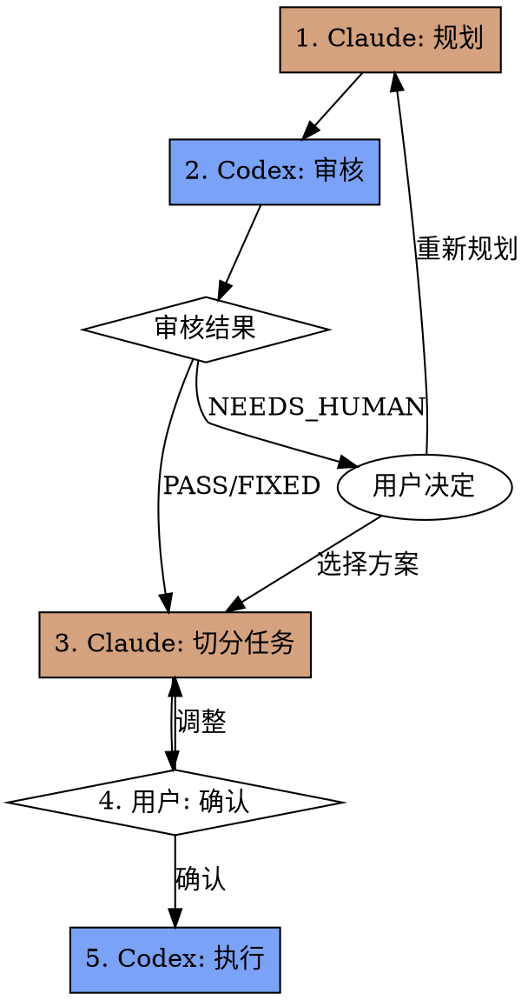

# Duet: Claude + Codex 协作工作流

## 概述

**Duet** 是一个双 Agent 协作工作流 skill，利用两个 Agent 的各自优势：

- **Claude Code**：擅长规划、架构设计、复杂推理、任务切分
- **Codex**：擅长高效执行、代码审查、终端任务

**核心原则**：质量优先，兼顾效率

## 何时使用

- 复杂功能开发需要规划
- 多文件修改需要协调
- 质量要求高的关键代码
- 需要外部审核确保方案合理

## 何时不使用

- 简单的单文件修改（直接用 Codex）
- 紧急修复（跳过审核流程）
- 纯探索性任务（无需正式规划）

---

## 工作流程



**核心原则：一次审核，能解即解**

- PASS → 无问题，继续
- FIXED → Codex 已解决，继续（回复中说明解决方案）
- NEEDS_HUMAN → 需人工决定，暂停给用户

### 流程阶段

| 阶段 | 执行者 | 输入 | 输出 |
|------|--------|------|------|
| 1. 规划 | Claude | 用户需求 | 规划文档（含参考文件） |
| 2. 审核 | Codex | 规划文档 | PASS / FIXED / NEEDS_HUMAN + 切分建议 |
| 3. 处理结果 | Claude | 审核结果 | 继续流程 或 询问用户 |
| 4. 切分 | Claude | 审核建议 + 规划 | 任务设计文档 |
| 5. 确认 | 用户 | 任务列表 | 确认/调整 |
| 6. 执行 | Codex | 任务设计文档 | 实现代码 |

---

## 阶段 1：Claude 规划

### 输出位置

规划文档保存到 `docs/superpowers/specs/YYYY-MM-DD-<name>-design.md`

### 规划文档模板

创建规划时，使用以下格式：

```markdown
# [功能名称] 设计文档

> **目标**：[一句话描述要构建什么]
> **作者**：Claude Code
> **日期**：YYYY-MM-DD

## 架构设计

[2-3 句描述整体架构]

## 技术方案

### 组件 1
[描述]

### 组件 2
[描述]

## 参考文件

> Codex 审核时需要阅读以下文件以理解上下文

- `path/to/file1.ts` - [文件作用说明]
- `path/to/file2.ts` - [文件作用说明]

## 边界情况

[需要考虑的边界情况]

## 风险点

[可能的技术风险或不确定点]
```

### 规划原则

1. **必须列出参考文件** - 让 Codex 能阅读相关上下文
2. **保持简洁** - 目标 < 300 行
3. **明确边界** - 清晰定义功能范围

---

## 阶段 2：Codex 审核

**核心原则：一次审核，能解即解**

Codex 审核时发现问题：
- **能解决** → 直接在审核结果中给出解决方案，继续流程
- **需人工决定** → 返回给 Claude，由 Claude 询问用户

### 调用命令

规划完成后，调用 Codex 进行审核：

```bash
codex exec "
Review the design document at docs/superpowers/specs/xxx-design.md

## 审核任务

1. 阅读规划文档中的「参考文件」部分，逐一阅读所有列出的文件
2. 检查以下方面：
   - 逻辑完整性：是否有遗漏的场景或边界情况？
   - 技术可行性：方案是否能实现？是否有更好的替代方案？
   - 代码一致性：与现有代码风格和架构是否兼容？
   - 范围合理性：是否过度设计或范围蔓延？

3. 建议任务切分方式：
   - 建议将此规划切分为多少个任务？
   - 每个任务的粒度建议是什么？
   - 任务之间是否有依赖关系？

## 输出格式

REVIEW_RESULT: PASS | FIXED | NEEDS_HUMAN

FIXES_APPLIED:  # 仅当 REVIEW_RESULT 为 FIXED 时填写
- 问题: [问题描述] → 解决: [解决方案描述]
- 问题: [问题描述] → 解决: [解决方案描述]

HUMAN_DECISION_NEEDED:  # 仅当 REVIEW_RESULT 为 NEEDS_HUMAN 时填写
- [需要人工决定的问题1]
- [需要人工决定的问题2]

SPLIT_SUGGESTION:
- Task 1: [任务名称] - [简要描述] - 依赖: 无
- Task 2: [任务名称] - [简要描述] - 依赖: Task 1
- ...

COMMENTS:
[其他建议或观察]

## 重要说明

- 能自行解决的问题，直接在 FIXES_APPLIED 中说明用什么方法解决了什么问题
- 只有真正需要用户决策的问题才返回 NEEDS_HUMAN（如：多种方案各有优劣、涉及业务逻辑选择等）
- 不会重新审核，请一次审核完整
"
```

### 审核输出解析

解析 Codex 的输出：

- `REVIEW_RESULT`：
  - `PASS` → 无问题，继续切分
  - `FIXED` → Codex 已解决发现的问题，查看 FIXES_APPLIED 了解详情，继续切分
  - `NEEDS_HUMAN` → 需要人工决定，暂停流程
- `FIXES_APPLIED`：Codex 解决了哪些问题，用什么方法
- `HUMAN_DECISION_NEEDED`：需要用户决定的问题列表
- `SPLIT_SUGGESTION`：用于指导任务切分

---

## 阶段 3：处理 Codex 审核结果

### 三种结果的处理

| 结果 | 含义 | 处理方式 |
|------|------|----------|
| `PASS` | 规划没问题 | 直接进入切分阶段 |
| `FIXED` | Codex 已解决问题 | 记录 FIXES_APPLIED 到任务文档，继续流程 |
| `NEEDS_HUMAN` | 需要人工决定 | 暂停，询问用户 |

### NEEDS_HUMAN 的处理

当 Codex 返回 `NEEDS_HUMAN` 时：

1. 向用户展示 `HUMAN_DECISION_NEEDED` 中的问题
2. 提供可选方案（如有）
3. 等待用户决定：
   - **选择方案** → 继续流程
   - **重新规划** → 返回阶段 1
   - **取消** → 终止工作流

---

## 阶段 4：Claude 切分任务

### 目录结构

```
docs/superpowers/
├── specs/
│   └── 2026-03-21-feature-design.md    # 总体规划文档
└── tasks/
    └── 2026-03-21-feature/
        ├── 01-task-name.md              # 任务1设计文档
        ├── 02-task-name.md              # 任务2设计文档
        └── ...
```

### 任务设计文档模板

```markdown
# Task 01: [任务名称]

> **所属规划**：@../specs/YYYY-MM-DD-feature-design.md
> **依赖任务**：无 | @02-other-task.md

## 目标文件

- `src/path/to/file.ts` - [文件作用]

## 任务描述

[2-3 句话描述要做什么]

## 实现细节

### 函数/组件 1
- 功能：[描述]
- 参数：[描述]
- 返回值：[描述]
- 错误处理：[描述]

## 参考文件

> 执行时需要阅读的上下文文件

- `src/types/xxx.ts` - [类型定义]

## 验收标准

- [ ] [标准1]
- [ ] [标准2]
- [ ] [标准3]

## 注意事项

[特殊情况、已知约束等]
```

### 切分原则

1. **最小执行单元** - 每个任务应独立可执行、可测试
2. **明确依赖** - 如有依赖，必须在「依赖任务」中注明
3. **自包含** - 任务文档包含所有执行所需信息
4. **粒度适中** - 单个任务预计执行时间 5-15 分钟

---

## 阶段 5：用户确认

### 确认内容

向用户展示：

1. **任务列表摘要**
2. **依赖关系图**（如有依赖）
3. **预计执行顺序**

### 用户选项

- **确认** → 开始执行
- **调整** → 返回切分阶段
- **取消** → 终止工作流

---

## 阶段 6：Codex 执行

### 执行命令模板

**无依赖任务**：

```bash
codex exec "
Read task design: docs/superpowers/tasks/YYYY-MM-DD-feature/01-task-name.md

## 执行步骤

1. 阅读「参考文件」部分的所有文件
2. 按照「实现细节」实现代码
3. 验证所有「验收标准」已满足
4. 如有问题，在输出中说明

## 输出格式

STATUS: DONE | DONE_WITH_CONCERNS | BLOCKED
CHANGES: [修改了哪些文件]
VERIFICATION: [验收标准检查结果]
CONCERNS: [如有问题或疑虑]
"
```

**有依赖任务**：

```bash
codex exec "
Read task design: docs/superpowers/tasks/YYYY-MM-DD-feature/03-task-name.md

## 执行步骤

1. 阅读「依赖任务」部分的任务设计文档，理解上下文
2. 阅读「参考文件」部分的所有文件
3. 按照「实现细节」实现代码
4. 验证所有「验收标准」已满足

## 输出格式

STATUS: DONE | DONE_WITH_CONCERNS | BLOCKED
CHANGES: [修改了哪些文件]
VERIFICATION: [验收标准检查结果]
CONCERNS: [如有问题或疑虑]
"
```

### 执行结果处理

| STATUS | 含义 | 处理方式 |
|--------|------|----------|
| `DONE` | 成功完成 | 继续下一个任务 |
| `DONE_WITH_CONCERNS` | 完成但有疑虑 | 检查疑虑，决定是否继续 |
| `BLOCKED` | 无法完成 | 分析阻塞原因，人工介入 |

### 执行检查点

每个任务完成后：
1. 检查 Codex 输出的 `VERIFICATION` 部分
2. 确认验收标准达成
3. 如有 `CONCERNS`，评估是否影响后续任务
4. 记录执行进度

---

## 前置条件

- 已安装 Codex CLI：`npm install -g @openai/codex`
- 已配置 Codex 认证
- 项目已初始化 git

---

## Red Flags

**绝不**：

- 跳过 Codex 审核阶段
- 忽略 NEEDS_HUMAN（必须询问用户）
- 在用户确认前开始执行
- 让 Codex 执行没有设计文档的任务
- 反复审核（一次审核，能解即解）

**如果 Codex 返回 NEEDS_HUMAN**：

- 暂停工作流
- 向用户清晰展示需要决定的问题
- 提供可选方案（如有）
- 等待用户选择后继续

**如果 Codex 返回 BLOCKED**：

---

## 快速参考

| 阶段 | 命令/动作 |
|------|----------|
| 规划 | 创建 `docs/superpowers/specs/xxx-design.md` |
| 审核 | `codex exec "Review..."` → PASS / FIXED / NEEDS_HUMAN |
| 处理结果 | PASS/FIXED 继续，NEEDS_HUMAN 询问用户 |
| 切分 | 创建 `docs/superpowers/tasks/xxx/` 目录和任务文档 |
| 确认 | 向用户展示任务列表 |
| 执行 | `codex exec "Execute task..."` |
